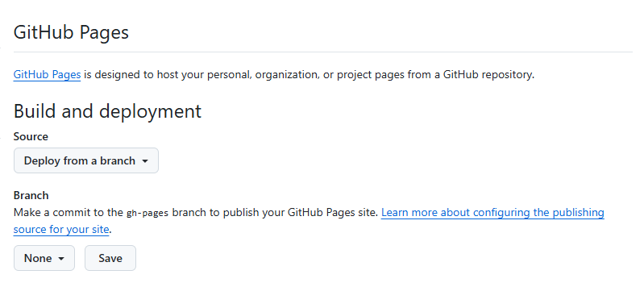

# **在Github Pages中使用Mkdocs（基础篇）**

不在本地安装 mkdocs，而是把它放在 CI/CD 流程里（比如 GitHub Actions、Forgejo Actions、GitLab CI）。这样只要 git push，服务器就会自动拉取代码、执行 mkdocs build，并把生成的静态网站部署到目标位置（比如 GitHub Pages、服务器的 /var/www/html，或者一个专门的分支）。

**使用 GitHub Actions 在云端自动构建和部署 MkDocs 网站**。

这种方法的优势非常明显：

- **无需在本地安装** MkDocs、Python 或任何依赖。
- **自动化**：每次 `git push` 到 `main` 分支时，GitHub 会自动构建网站并部署。
- **环境一致**：避免了“在我机器上能运行”的问题。


## **设置 GitHub Actions 自动化部署**

假设项目名称为：techdocs。详细步骤如下：


### **一、本地设置**


#### **(一）仓库目录结构**    

```bash
   techdocs/
       ├── mkdocs.yml          # mkdocs 配置文件（必须）
       ├── docs/               # 文档目录，所有md文档都在这个目录及子目录下
       │   ├── index.md        # MkDocs 项目的首页文档，也是整个文档网站的入口页面
       │   ├── techdocs/              # 子目录按需创建
       │   │   └── python-basics.md   # md文档，将转化为网页显示
       │   ├── life/
       │   │   └── travel-japan.md
       │   └── ...
       └── .github/            # GitHub Actions 工作流的目录
           └── workflows/
               └── deploy.yml  # GitHub Actions 工作流（需要创建）
```
  **关键**：确保 `mkdocs.yml` 文件在仓库的**根目录**。    


#### **（二）创建 mkdocs.yml 配置文件**    


   在 MkDocs 中，mkdocs.yml 是项目的核心配置文件，用于定义网站的结构、主题、插件等所有设置。以下是一个简单的配置，不使用第三方主题：    
   
   
```yaml
site_name: 我的笔记   # 项目名称
docs_dir: docs       # 指定文档目录，缺省是docs

plugins:             # 使用的插件
  - search           # search插件是内置且默认启用的

```
   
   
#### **（三）编写markdown文档**  

   
   首先，编写index.md，例如：    
   
```markdown
# 欢迎来到我的学习笔记
这里是我的学习笔记，使用 Markdown 编写。
```
   根据需要，在docs目录下建立子目录，例如：tech、life等。

   
#### **（四）创建 GitHub Actions 工作流文件**    
   
   在仓库中创建一个特殊的文件来定义自动化流程。
   
   在你的仓库根目录创建文件夹 `.github/workflows/`。
   在该文件夹中创建一个 YAML 文件，例如 `deploy.yml`。
   
   **文件内容 `deploy.yml`：**
   
```yaml
# .github/workflows/deploy.yml
name: Deploy MkDocs Site

# 触发条件：当推送到 main 分支时
on:
  push:
    branches:
      - main

jobs:
  deploy:
    # 运行在 GitHub 提供的虚拟机上
    runs-on: ubuntu-latest    # Github远程ubuntu虚拟机，占用的是Github的资源

    steps:
      # 1. 检出仓库代码
      - name: Checkout code
        uses: actions/checkout@v4

      # 2. 设置 Python 环境
      - name: Set up Python
        uses: actions/setup-python@v5
        with:
          python-version: 3.x

      # 3. 安装 MkDocs 和主题
      - name: Install dependencies
        run: |
          pip install mkdocs    # 这里只使用mkdocs，不使用第三方主题和插件          
          # pip install mkdocs-material # 如果在 mkdocs.yml 中使用 material 主题
          # 如果需要其他插件，也在这里安装，例如：
          # pip install mkdocs-awesome-pages-plugin
          # pip install mkdocs-minify-plugin

      # 4. 构建网站（生成 site/ 目录）
      - name: Build site
        run: mkdocs build

      # 5. 部署到 GitHub Pages
      - name: Deploy to GitHub Pages
        uses: peaceiris/actions-gh-pages@v3
        with:
          github_token: ${{ secrets.GITHUB_TOKEN }}
          publish_dir: ./site
```


### **二、在Github上设置**  
   
   
#### **（一）设置 GitHub 使用 SSH 连接** 
   
   略
   

#### **（二）创建仓库**  
   
   在 Github 上创建一个仓库 techdocs。    
   
   
#### **（三）修改仓库Action权限（重要）**  
   
   
1. 进入你的 GitHub 仓库 -> `Settings`。    

2. 在左侧菜单中找到 `Actions` -> `General`。    

3. 向下滚动到 **"Workflow permissions"**。缺省的是这样的：    


   

4. 确保选择了 **`Read and write permissions`**。    
   
    - ❌ 不要选 `Read repository contents permission`。
    - ✅ 必须选 `Read and write permissions`，因为部署需要写入 `gh-pages` 分支。
   
5. 点击 `Save`。    
   
   
#### **（四）推送代码并触发构建**  
   
   
```bash
git init
git add .
git commit -m "first commit"
git branch -M main
git remote add origin git@github.com:<username>/techdocs.git
git push -u origin main
```
   
   
#### **（五）查看构建状态**    
   
1. 进入你的 GitHub 仓库。    
   
   
2. 点击 `Actions` 标签页。    
   
   
3. 你会看到一个名为 "Deploy MkDocs Site" 的工作流正在运行。    
   
   
4. 等待它完成（通常需要 1-2 分钟）。    
   
   
   如果一切顺利，你会看到绿色的勾号。    
   

   
   
#### **（六）启用 GitHub Pages**    
   
   
   **1. 进入 techdocs GitHub 仓库 -> `Settings` -> `Pages`。**      

   

   
   
   **2. 在 `Build and deployment` 部分：**    
   - **Branch**: 选择 `gh-pages`
   - **/root**: 选择根目录


   
   
   **3. 点击 `Save`。**    
   
   
   **注意**：`actions-gh-pages` Action 会自动创建 `gh-pages` 分支并推送构建后的文件。


#### **（七）访问你的网站**  
   
  
   构建成功后，网站就可以通过以下地址访问了：    
  
```
https://<你的用户名>.github.io/<仓库名>/
```

   例如：`https://mudxkx.github.io/techdocs/`


    
下一篇，我们将使用mkdocs的第三方主题